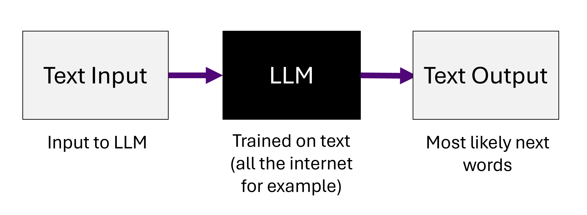
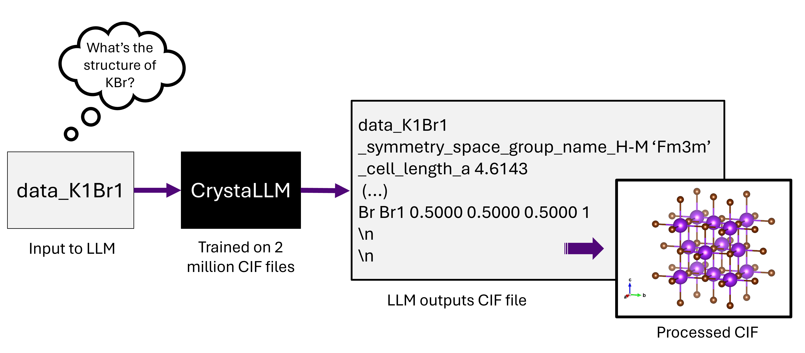
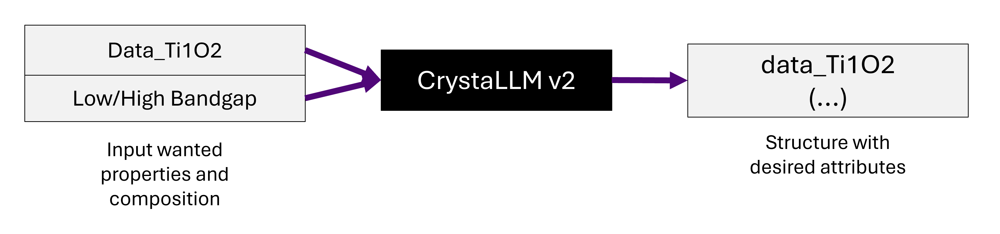

DFT Modelling of ML Generated Structures
=================

Welcome to the weeklong summer research project! I hope this week can give a flavor of what its like to be postgrad researcher (although I myself am figuring things out every day). 

I've made some google colab notebooks to help take you through the week and (hopefully) get some interesting results and new useful skills.

Don't worry if stuff doesnt work, thats part of research. Send me an email or come to my desk any time and hopefully I can help out!

The goal of this week is to help and figure out if some of the structures generated by a Machine Learning algorithm developed in this group are actually useful.

## What I've been doing the past year

### The Generative Model - CrystaLLM
The model used to generate structures is based on [CrystaLLM](https://arxiv.org/abs/2307.04340). To quickly summarize, the model is a large language model based on GPT-2 architecture (older and smaller version of ChatGPT). 

However, rather than being trained to answer questions by generating text word by word, it is trained to generate crystal structures in the form of a Crystalographic Information File (CIF), by generating the contents of the file step by step. Intuitively, its a bit like the auto-complete on our phones but instead of giving a next likely word or group of words, itd be what is the likely structure from an input atomic composition.
> **Note**: `If you dont know what a CIF file is, dont worry, we'll also go through that in the notebook.

If you find LLMs confusing, thats ok, we wont be using them in this project, but if you're interested in reading more about them I can recommend a few blogposts like [this one](https://www.lakera.ai/blog/large-language-models-guide) or [another one - more in depth](https://jalammar.github.io/illustrated-gpt2/). I would return to this after the project if you are interested!

### Conditioning CrystaLLM

So the model already exists and its available to use. What I've been trying to do this year is try to edit the model so that it can try to generate a structure with a wanted property. Essentially, rather than just learning how to generate a structure from a given composition, we generate a structure from a given **composition** and **property**

